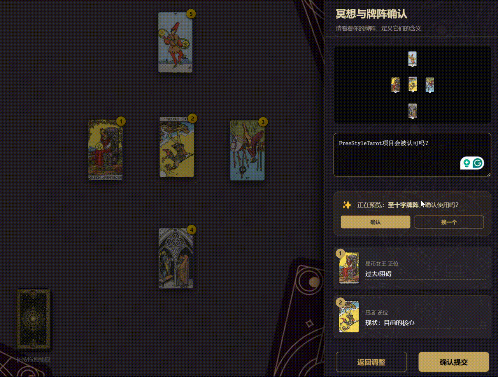

# FreeStyleTarot

## ⭐️ 项目概述

**FreeStyleTarot** 是一个基于塔罗牌的 AI 占卜系统：前端支持自由抽牌、自定义牌阵与牌阵自动识别；后端结合嵌入的塔罗知识库与大模型 API，通过可扩展的多 Agent 流水线对用户问题与牌阵进行分层解读，并以**分阶段流式 Markdown** 输出个性化建议。

公开仓库中 **`storage/` 仅保留说明文档**，提示词与牌义库需在本地补全后再编译后端。AI 解析的设计细节见 [`storage/README.md`](storage/README.md)。

## ✨ 功能和亮点

- 🖥️ **多端适配**：PC 与移动端均可使用，支持 Capacitor 打包 Android（`web/android/`）。
- 🔐 **用户账号**：邮箱密码登录、验证码登录/注册；注册与找回密码均需邮箱验证码；JWT 会话；个人资料页查看与修改昵称、会员状态、账户余额与占卜配额。
- 📜 **提问历史**：登录用户在个人资料页查看近期占卜记录，可展开查看完整解析与当时牌阵；流式占卜结束后自动写入。
- 🔮 **自由牌阵**：随意摆牌组成阵面，前端可自动识别常见牌阵，也可手动填写阵位含义。
- 📚 **知识库驱动**：按抽到的牌名与正逆位精确检索牌义，控制上下文长度（非向量 RAG）。
- 🤖 **多 Agent 解读**：牌阵内部分析 → 人设建议，职责拆分；内部步骤不向前端泄露正文，仅公开步骤流式输出终稿。
- ⚡ **分阶段流式体验**：按 Agent 阶段依次展示 loading 与正文（类似 Cursor/Codex 的分段输出）；提问标题在 pipeline 启动前即推送，缩短首屏等待。
- 👁️ **阵面坐标**：前端上报每张牌的坐标与阵位，供后续视觉分析环节理解牌阵空间关系（视觉 Agent 仍在规划中，见 `storage/README.md`）。
- 💘 **多角色人设**：默认、女友、猫娘、雌小鬼等风格，主要影响建议阶段的语气。
- 🎯 **交互能力**：卡牌缩放与清除、阵位含义自定义、**提交前意图澄清选择题**、结果复制与存图、流式 Markdown 展示、系统公告。

## 👀 效果演示

|       |  |  |
|:------------------:|:------------------:|:------------------:|

## 📁 项目结构

前后端分离：**Vue 3 + Vite**（`web/`）+ **Golang + Gin**（根目录 Go 模块）。

```
FreeStyleTarot/
├── main.go                 # 入口：初始化配置、数据库、路由
├── api/                    # HTTP 处理器与中间件
│   ├── auth_handler.go     # 注册、登录、验证码、个人资料
│   ├── predict_history_handler.go
│   ├── announcement_handler.go
│   ├── HandlePredictStream.go
│   ├── HandleClarify.go
│   ├── HandlePrompt.go
│   └── middleware/         # CORS、JWT 鉴权、占卜配额
├── config/                 # config.yaml + 环境变量加载
├── db/                     # PostgreSQL 连接、Redis、SQL migration
│   └── migrations/         # users、predict_history、user.balance 等
├── model/                  # 请求/响应、用户、历史记录等结构体
│   ├── request/
│   ├── response/
│   ├── user/
│   └── predict_history/
├── repository/             # 数据访问层
│   ├── user/
│   ├── history/            # 提问历史
│   └── verify/             # 验证码 Redis 存储
├── service/                # 业务逻辑
│   ├── auth/               # 用户认证、密码、会话与配额
│   ├── email/              # Resend 邮件发送
│   ├── history/            # 提问历史写入与列表
│   ├── workflow/           # 通用流水线与 SSE 协议
│   │   ├── sse.go          # intro / phase_start / delta / phase_end / outro
│   │   ├── pipeline.go     # 可复用 Step 编排
│   │   └── tarot/          # 塔罗占卜 Agent、提示词、知识库素材检索依赖
│   └── ...                 # 大模型调用等基础设施
├── storage/                # 嵌入用的提示词与知识库（公开版仅 README）
├── web/                    # 前端
│   ├── src/
│   │   ├── components/     # TarotMain、AnswerModal、ProfilePredictHistory 等
│   │   ├── composables/    # useAuth、usePredictHistory、useAnnouncement
│   │   ├── spread/         # 牌阵识别模板（凯尔特十字、圣三角等）
│   │   └── utils/          # authApi、predictStream、streamBlocks、predictHistoryApi 等
│   └── android/            # Capacitor Android 工程
├── assets/                 # README 演示 GIF
├── .do/                    # DigitalOcean App Platform 部署配置
├── Dockerfile
└── .env-example            # 环境变量模板
```

| 目录 | 说明 |
|------|------|
| `web/` | 抽牌、牌阵编辑与识别、登录/个人资料、提问与历史回看；将牌名、正逆位、阵位含义、坐标等提交后端 |
| `api/` | HTTP 入口：认证（`/auth/*`）、公告（`/announcement`）、占卜（`/predict`、`/prompt`） |
| `service/workflow/` | 通用 SSE 事件与 Step 流水线；塔罗相关 Agent/提示词/素材在 `workflow/tarot/` |
| `service/history/` | 流式占卜完成后持久化提问记录，按会员等级限制条数 |
| `repository/` | 用户表、提问历史、验证码的持久化访问 |
| `db/` | PostgreSQL（pgx）、Redis、启动时 migration |
| `config/` | 服务运行模式、鉴权开关、公告与各 Agent 的 token、温度等 |
| `model/` | 请求/响应、用户、历史记录等结构体 |
| `storage/` | 嵌入用的提示词与知识库（公开版仅 README，见该目录说明） |

入口：`main.go` 启动 Gin 并注册路由；`tarot.Init()` 预热知识库、RAG 索引与背景 prompt。环境变量见 [`.env-example`](.env-example)（大模型 API、数据库、JWT、Redis、邮件等）。`config/config.yaml` 可配置是否强制登录（`auth.force_login`）、是否跳过邮件验证（`auth.skip_verify`）及公告内容。

## 🔌 API 概览

| 路由 | 鉴权 | 说明 |
|------|------|------|
| `GET /announcement` | 无 | 系统公告 |
| `GET /auth/config` | 无 | 前端鉴权配置（如是否强制登录） |
| `POST /auth/send-code` | 无 | 发送邮箱验证码 |
| `POST /auth/verify` | 无 | 校验邮箱（注册前置） |
| `POST /auth/verify-code` | 无 | 验证码登录 |
| `POST /auth/complete-code-signup` | 无 | 验证码注册补全 |
| `POST /auth/login` | 无 | 密码登录 |
| `POST /auth/register` | 无 | 密码注册（需邮箱验证码） |
| `POST /auth/reset-password` | 无 | 邮箱验证码重置密码 |
| `GET /auth/me` | 需登录 | 获取当前用户（含余额等） |
| `PATCH /auth/me` | 需登录 | 更新个人资料（如昵称） |
| `GET /auth/predict-history` | 需登录 | 获取提问历史（条数上限随会员等级变化） |
| `POST /clarify` | 需登录 | 意图澄清：分析提问并返回补充选择题（不消耗占卜配额） |
| `POST /predict` | 需登录 + 配额 | 流式占卜（SSE） |
| `POST /prompt` | 需登录 + 配额 | 调试提示词拼装 |

## 📚 AI 解析（概览）

### Agent 流水线

当前已实现三步 Agent + 提交前意图澄清：

```text
意图澄清（intent_clarifier）— 提交前独立 API，向用户展示最多 3 道选择题；答案作为补充上下文注入后续 Agent
    ↓
牌阵解读（spread_analyst）— 内部步骤，结合知识库做能量与逐牌分析，结果不推送给前端
    ↓
综合建议（advisor）— 内部步骤，基于解读摘要做综合判断与行动指引，结果不推送给前端
    ↓
人设转写（persona）— 按角色卡将建议转写为带风格的流式正文（用户看到的正文）
```

- **意图澄清**：用户点击提交后，后端分析原始提问；若信息不足则弹出选择题（可跳过、可回退）；澄清结果写入 `clarifications` 并注入解读/建议 Prompt 与 intro 展示。

- **素材**：结构化短库 + 长文牌义按牌名命中；解读 Agent 用全文素材，建议 Agent 用截断后的 digest + 上一步分析。
- **提示词**：每个 Agent 独立 System（`spread_analyst_system.md` / `advisor_system.md` / `persona_system.md` / `visual_flow_system.md`）+ 角色卡（仅 persona 加载）；User 消息以 `[ACTIVE AGENT: …]` 标识当前职责。提示词与流水线实现位于 `service/workflow/tarot/`，不对外公开。
- **扩展新 Agent**：在 `workflow/tarot/steps.go` 的 `tarotSteps()` 中追加 `workflow.Step` 即可；`workflow.RunPipeline` 自动处理阶段边界。

### 流式 SSE 协议

`/predict` 使用 Server-Sent Events，每条 `data:` 为独立 JSON，**Markdown 只出现在 `text` 字段**，避免与 SSE 行格式冲突：

| `type` | 含义 |
|--------|------|
| `intro` | 提问标题等开场 Markdown |
| `phase_start` | 某 Agent 阶段开始，携带 `phase` 与 `label`（前端显示 loading） |
| `delta` | 该阶段的 Markdown 片段（仅公开阶段会发送） |
| `phase_end` | 阶段结束，关闭 loading |
| `outro` | 页脚等收尾 Markdown |

典型时序：

```text
intro → phase_start(spread_analyst) → phase_end
      → phase_start(advisor) → phase_end
      → phase_start(persona) → delta × N → phase_end
      → outro → [DONE]
```

前端 `streamBlocks.js` 按 block 渲染「本阶段 loading → 本阶段正文」；`intro` 在 pipeline 之前发送，牌阵素材构建与内部分析在首个 `phase_start` 之后进行，以改善首屏反馈。完整回答文本在流结束后写入 `predict_history` 表。

本地完整运行需自行准备 `storage` 嵌入资源、PostgreSQL、Redis（验证码场景）及 `.env` 配置后编译；仅克隆公开仓库时请先阅读 `storage/README.md`。

## 🤗 想为项目做贡献? 欢迎新建 issue 讨论你的想法！

包括不限于 **Prompt 调整、牌阵建议、知识库扩展、交互优化、美术素材、Bug 修复** 等内容。

## 📜 免责声明

本项目仅供娱乐和学习使用，所有占卜结果仅供参考，不应被视为专业建议。开发者不对任何因使用本项目而产生的直接或间接损失负责。
