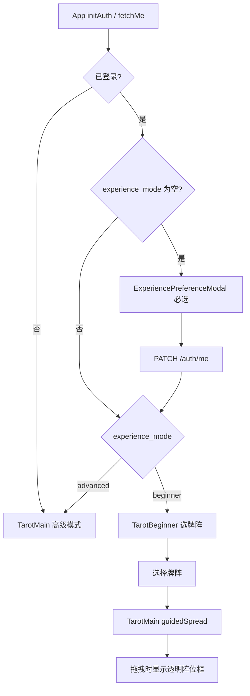

# 新手塔罗引导与偏好分流

## 目标架构



游客（未登录）：**始终 `TarotMain` 高级模式**，不弹偏好窗（已确认）。

---

## 1. 数据库与后端 API

### Migration `000005_add_user_experience_mode`

新增列（[`db/migrations/`](db/migrations/)）：

```sql
ALTER TABLE users
  ADD COLUMN experience_mode VARCHAR(16) DEFAULT NULL;
-- 合法值: 'beginner' | 'advanced'；NULL 表示未选择
```

### 模型与仓储

| 文件 | 变更 |
|------|------|
| [`model/user/user.go`](model/user/user.go) | `User.ExperienceMode *string`；`PublicUser.ExperienceMode *string`（JSON `experience_mode`） |
| [`repository/user/repository.go`](repository/user/repository.go) | `userColumns` 增加字段；新增 `UpdateExperienceMode`；将 `UpdateNickname` 扩展为 `UpdateProfile(ctx, id, nickname *string, experienceMode *string)` 支持部分更新 |
| [`service/auth/service.go`](service/auth/service.go) | `UpdateNickname` → `UpdateProfile`；校验 `experience_mode` 仅允许 `beginner`/`advanced` |
| [`api/auth_handler.go`](api/auth_handler.go) | `patchMeRequest` 改为 `nickname` 与 `experience_mode` 均可选，但至少提供一个；昵称校验仅在传入时执行 |

`GET /auth/me`、登录/注册响应中的 `user` 对象自动带上 `experience_mode`，前端 [`useAuth.js`](web/src/composables/useAuth.js) 的 `persistUser` 无需额外接口。

### PATCH 示例

```json
{ "experience_mode": "beginner" }
```

---

## 2. 牌阵元数据扩展（自动目录）

现有 [`web/src/spread/*.js`](web/src/spread/) 仅有 `name`、`cardCount`、`match`。为支持预览与阵位引导，每个牌阵文件补充：

```js
export default {
  id: 'holyTrinity',           // 稳定 slug
  name: '圣三角牌阵',
  cardCount: 3,
  description: '适合了解事情的过去、现在与未来……',  // 新手页展示
  slots: [                     // 0–11 网格坐标 + 阵位含义（与 match 语义一致）
    { gridX: 2, gridY: 5, meaning: '过去' },
    { gridX: 5, gridY: 5, meaning: '现在' },
    { gridX: 8, gridY: 5, meaning: '未来' },
  ],
  match: (gridCards) => { /* 保持不变 */ },
};
```

### 目录聚合 [`web/src/spread/index.js`](web/src/spread/index.js)

- 保留 `SPREAD_TEMPLATES` 供 [`SubmitModal.vue`](web/src/components/SubmitModal.vue) 识别逻辑使用。
- 新增 `getSpreadCatalog()`：过滤出具备 `id`、`description`、`slots` 且 `slots.length === cardCount` 的模板，返回 UI 安全对象（不含 `match`）。
- **新增牌阵时**：在 `spread/` 下新建文件并在 `index.js` 注册（与现有一致）；补齐 `id`/`description`/`slots` 后自动出现在新手页。

### 布局工具 [`web/src/utils/spreadLayout.js`](web/src/utils/spreadLayout.js)（新建）

基于 `slots` 的 `gridX/gridY`（0–11 绝对网格）：

- `slotsToPreviewCards(slots, cardWidth, cardHeight)` → 生成 `MiniTarot` 可用的伪卡牌坐标（牌背 + order 徽章）。
- `layoutSlotsInStage(slots, stageWidth, stageHeight, cardWidth, cardHeight)` → 在当前舞台居中缩放后的像素 `(x, y, meaning, slotIndex)`，供透明框与吸附使用。

复用 [`recoverFromGrids`](web/src/utils/cardGrid.js) 的逆映射思路：以固定参考包围盒将 grid 坐标转为像素，再按舞台尺寸等比缩放居中。

需为全部 10 个现有牌阵编写 `slots`（依据各 `match` 函数的空间语义，如圣三角横排、凯尔特十字左右分区等）。

---

## 3. 前端偏好与路由编排

**不引入 vue-router**（项目当前无路由依赖），在 [`App.vue`](web/src/App.vue) 用视图状态切换，与现有单页结构一致。

### 新建 composable [`web/src/composables/useTarotFlow.js`](web/src/composables/useTarotFlow.js)

```js
// view: 'beginner' | 'main'
// selectedSpread: catalog item | null
// showPreferenceModal: boolean
```

逻辑：

- `initAfterAuth(user)`：`experience_mode === null` 且已登录 → `showPreferenceModal = true`。
- `experience_mode === 'beginner'` → `view = 'beginner'`；`'advanced'` → `view = 'main'`。
- 选牌阵后 → `selectedSpread = spread`，`view = 'main'`。
- Profile 修改偏好后响应式切换视图。

### 新建 [`web/src/components/ExperiencePreferenceModal.vue`](web/src/components/ExperiencePreferenceModal.vue)

- 两段式状态栏（与需求 0 对齐）：
  - **我不了解塔罗牌** → `beginner`
  - **我了解塔罗牌** → `advanced`
- 首次必选、不可关闭；保存后调用 `patchMe` + 更新 `useAuth` 缓存。
- 样式参考 [`AnnouncementModal.vue`](web/src/components/AnnouncementModal.vue) 的 overlay 规范。

### 扩展 [`useAuth.js`](web/src/composables/useAuth.js) + [`authApi.js`](web/src/utils/authApi.js)

- `patchMe(token, { nickname?, experience_mode? })`
- `updateExperienceMode(mode)` 封装

### 扩展 [`ProfileDrawer.vue`](web/src/components/ProfileDrawer.vue)

在昵称下方增加「塔罗体验」分段选择器，保存时 PATCH `experience_mode`；切换后立即生效（回到选阵页或主界面）。

### 更新 [`App.vue`](web/src/App.vue)

```vue
<ExperiencePreferenceModal v-if="showPreference" />
<TarotBeginner v-else-if="isBeginnerFlow" @select="onSpreadSelect" />
<TarotMain v-else :guided-spread="selectedSpread" />
<AnnouncementModal />
```

在 `initAuth` / 登录成功 `fetchMe` 后调用 `useTarotFlow.initAfterAuth`。

---

## 4. 新手选阵页 [`web/src/components/TarotBeginner.vue`](web/src/components/TarotBeginner.vue)（新建）

- 顶部标题 + 简短引导文案。
- `getSpreadCatalog()` 渲染列表；每行：

```
┌─────────────┬──────────────────────────┐
│ MiniTarot   │ 牌阵名 / N 张牌          │
│ 预览        │ description 文案         │
│             │ [选择此牌阵] 按钮        │
└─────────────┴──────────────────────────┘
```

- **移动端**：单列堆叠（预览在上、介绍在下）。
- **宽屏（≥768px）**：双栏 grid（`grid-template-columns: 1fr 1fr`）。
- 右上角保留 Profile 入口（复用 TarotMain 同款按钮或抽成小组件）。
- 点击「选择此牌阵」→ emit → 进入 `TarotMain`。

---

## 5. TarotMain 引导模式（最小侵入）

通过 **可选 prop** `guidedSpread`（catalog 项）启用；无 prop 时行为与现版完全一致。

### 模板层 [`TarotMain.vue`](web/src/components/TarotMain.vue)

在 `.stage` 内、`Card` 组件之下增加：

```vue
<div v-if="guidedSpread && activeCard" class="spread-slot-layer">
  <div v-for="slot in visibleSlots" :key="slot.index"
       class="spread-slot-ghost"
       :style="{ left, top, width, height }">
    <span class="slot-label">{{ slot.meaning }}</span>
  </div>
</div>
```

- **仅在 `activeCard` 非空（正在拖拽）时显示**透明虚线框 + 阵位含义标签。
- 已占用的 slot 不显示（根据 `drawnCards` 与 slot 绑定关系判断）。

### 脚本层

- `onMounted` + `watch(guidedSpread)`：根据舞台尺寸计算 `layoutSlotsInStage` 缓存。
- `resize` / `baseWidth` 变化时重算。
- **`handlepointerUp` 增强**（仅 guided 模式）：
  - 找最近未占用 slot（距离阈值 ≈ 卡牌宽度的 40%）。
  - 吸附卡牌坐标；写入 `card.meaning`；记录 `card.slotIndex`。
- 限制抽牌数量：`drawnCards.length >= guidedSpread.cardCount` 时禁止从牌堆再抽。
- 新手专属 UI：左上角「更换牌阵」按钮（`emit('change-spread')` 或调用 `useTarotFlow` 回退）。
- `pile-label` 在 guided 模式改为「按虚线框摆放，共 N 张」类提示。

### SubmitModal 联动（小改）

当 `guidedSpread` 存在且所有卡牌已绑定 meaning 时：

- 打开弹窗时跳过牌阵识别询问，直接 `detectorState = 'accepted'`。
- 减少新手重复确认步骤。

通过 prop 或 provide/inject 将 `guidedSpread` 传入 `SubmitModal`。

---

## 6. 文件变更清单

| 层级 | 新建 | 修改 |
|------|------|------|
| DB | `000005_*.sql` | — |
| Go | — | `user.go`, `repository.go`, `service.go`, `auth_handler.go` |
| 前端组件 | `TarotBeginner.vue`, `ExperiencePreferenceModal.vue` | `App.vue`, `TarotMain.vue`, `ProfileDrawer.vue`, `SubmitModal.vue` |
| 前端逻辑 | `useTarotFlow.js`, `spreadLayout.js` | `useAuth.js`, `authApi.js`, `spread/index.js`, `spread/*.js`（10 个） |

**不改动**：占卜 API、Agent 流水线、Capacitor 配置、其他无关组件。

语言选择：沿用现有 **JS + Vue SFC** 风格（[`main.ts`](web/src/main.ts) 仅作入口），避免大范围 TS 迁移。

---

## 7. 验证要点

1. 新用户登录 → 弹出偏好选择 → 选新手 → 进入选阵页 → 选阵 → 拖拽时出现透明框 → 摆满后可提交。
2. 选高级 → 直接进入现有 TarotMain，无选阵页、无透明框。
3. Profile 修改偏好后视图即时切换；再次登录偏好保持。
4. 游客直接进入 TarotMain，无偏好弹窗。
5. 在 `spread/` 新增带完整元数据的牌阵并注册到 `index.js` → 重新 build 后新手页自动出现。
6. 运行 migration 后旧用户 `experience_mode = NULL`，下次登录弹窗。
